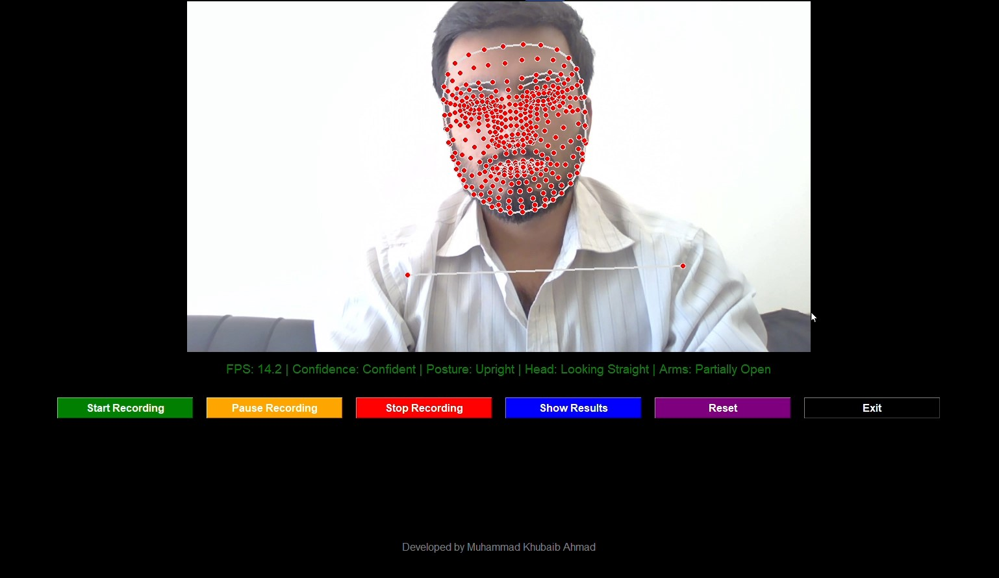
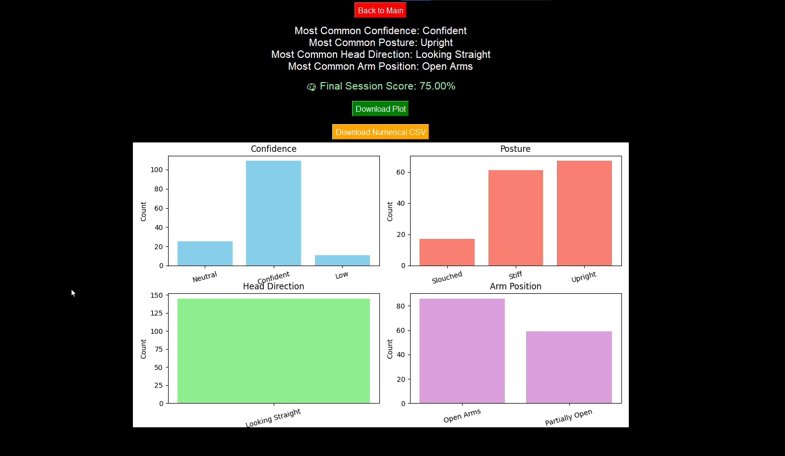

# ConfiDetect

**ConfiDetect** is a real-time confidence detection desktop application designed to analyze non-verbal communication during interviews, presentations, or public speaking sessions. Using pose estimation, it tracks head orientation, arm positions, and posture to provide live confidence scoring, session analytics, and exportable reports. It also allows students and professionals to understand their body language and improve their confidence based on actionable insights.

---

## Features

- Real-time **pose and posture tracking** using Mediapipe.
- Detection of **head position**, **arm state** (open/closed/partially open), and overall **posture**.
- **Live confidence scoring** displayed through a score meter.
- **Session controls**: Start recording, Pause, Stop, Reset session, and Exit.
- **Results section**: Visualizes session analytics with bar plots and confidence timelines.
- Export **numerical features** per frame as `.csv` for deeper analysis or ML model improvement.
- Generate **end-of-session reports** with session summary and analytics.
- Designed for **interview and presentation practice**, helping users improve their non-verbal communication skills.

---

## Screenshots

### Main Screen
  

### Results Section


---

## Technology Stack

- **Python Version:** 3.10.11
- **Libraries & Frameworks:**
  - `tkinter` / `ttkbootstrap` for GUI
  - `Mediapipe` for pose estimation
  - `OpenCV` for video capture and processing
  - `PIL` (Pillow) for image handling
  - `Matplotlib` for plotting analytics
  - `NumPy` and `Pandas` for numerical computations and CSV export
  - `TensorFlow` / `PyTorch` included in single-file build for ML tasks

---

## Installation & Running

> **Note:** The application is packaged as a single executable file containing all dependencies (Mediapipe, TensorFlow, PyTorch, OpenCV, etc.).

### Option 1: Run from Source
1. Clone the repository:
```bash
git clone <https://github.com/Khubaib8281/ConfiDetect.git>
```
2. Install dependencies:
```bash
pip install opencv-python mediapipe pillow matplotlib pandas numpy
```
3. Run the app:
```bash
python confiDetect.py
```

### Option 2: Run Executable
- Simply double-click the packaged `.exe` (if provided) to launch ConfiDetect without installing Python or dependencies.

---

## Usage Instructions

1. **Launch ConfiDetect**. The main screen will appear.
2. Use the session controls:
   - **Start Recording:** Begin capturing your session.   
   - **Pause / Resume:** Temporarily pause recording.
   - **Stop:** End the session.
   - **Reset Session:** Clear current session data.
   - **Exit:** Close the application.
3. After recording, go to the **Results Section**:
   - View **confidence scores**, **posture and gesture analytics**, and **summary plots**.
   - Export **numerical features per frame** as CSV for further analysis.
4. Use the analytics to identify areas for improvement in posture, gestures, and overall confidence.

---

## Purpose

ConfiDetect was created to help individuals objectively measure their confidence through non-verbal cues. Many students and professionals struggle to understand how their posture, gestures, and head movements affect perceived confidence. ConfiDetect bridges this gap by providing **real-time feedback**, **visual analytics**, and **exportable session data** to facilitate self-improvement.

---

## Future Improvements

- Upgrade GUI with **modern frameworks** like Flutter or PyQt for better UX.
- Add **comparative session analytics** to track improvement over time.
- Integrate **AI-driven feedback** based on posture trends to suggest actionable improvements.
- Extend support for **web and mobile platforms**.

---

## Author 


- **Name:** [Muhammad Khubaib Ahmad]  
- **Email:** [muhammadkhubaibahmad854@gmail.com]
- **GitHub:** [https://github.com/Khubaib8281]  

---    

## License

[Apache 2.0 lisence](LICENSE)

---

*ConfiDetect – AI-powered confidence insights for interviews, presentations, and personal growth.*
